# SlipSafe Technical Architecture

> System design, data models, and component diagrams

## Table of Contents

1. [System Overview](#system-overview)
2. [Architecture Diagram](#architecture-diagram)
3. [OCR Pipeline](#ocr-pipeline)
4. [Authentication Flow](#authentication-flow)
5. [Data Model](#data-model)
6. [Context Switching](#context-switching)
7. [Claims Lifecycle](#claims-lifecycle)
8. [Billing Integration](#billing-integration)
9. [Organization Hierarchy](#organization-hierarchy)
10. [PWA Architecture](#pwa-architecture)

---

## System Overview

SlipSafe is a monorepo application with three main layers:

```
┌─────────────────────────────────────────────────────────────┐
│                      CLIENT (React)                         │
│  ┌─────────┐ ┌─────────┐ ┌─────────┐ ┌─────────┐           │
│  │  Pages  │ │Components│ │  Hooks  │ │   PWA   │           │
│  └─────────┘ └─────────┘ └─────────┘ └─────────┘           │
├─────────────────────────────────────────────────────────────┤
│                      SERVER (Express)                       │
│  ┌─────────┐ ┌─────────┐ ┌─────────┐ ┌─────────┐           │
│  │  Routes │ │   Auth  │ │ Storage │ │   Lib   │           │
│  └─────────┘ └─────────┘ └─────────┘ └─────────┘           │
├─────────────────────────────────────────────────────────────┤
│                      SHARED (Types)                         │
│  ┌─────────────────────────────────────────────┐           │
│  │           schema.ts (Drizzle + Zod)          │           │
│  └─────────────────────────────────────────────┘           │
├─────────────────────────────────────────────────────────────┤
│                    EXTERNAL SERVICES                        │
│  ┌─────────┐ ┌─────────┐ ┌─────────┐ ┌─────────┐           │
│  │PostgreSQL│ │ Gemini │ │ Stripe  │ │ Resend  │           │
│  │ (Neon)  │ │Vision AI│ │Billing  │ │  Email  │           │
│  └─────────┘ └─────────┘ └─────────┘ └─────────┘           │
└─────────────────────────────────────────────────────────────┘
```

---

## Architecture Diagram

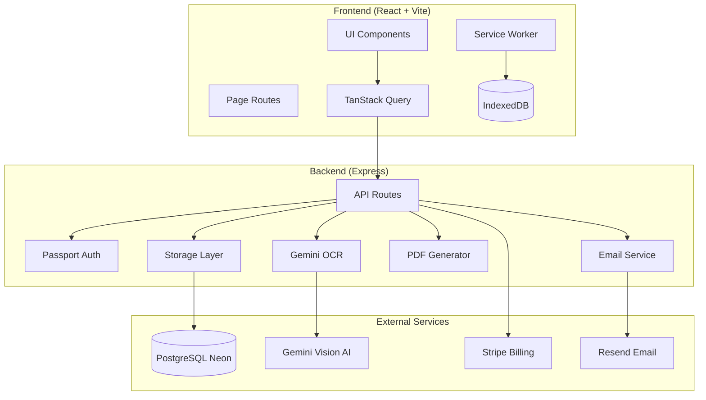
```mermaid
flowchart TB
    subgraph Client["Frontend (React + Vite)"]
        UI[UI Components]
        Pages[Page Routes]
        Query[TanStack Query]
        PWA[Service Worker]
        IDB[(IndexedDB)]
    end

    subgraph Server["Backend (Express)"]
        Routes[API Routes]
        Auth[Passport Auth]
        Storage[Storage Layer]
        OCR[Gemini OCR]
        PDF[PDF Generator]
        Email[Email Service]
    end

    subgraph External["External Services"]
        Neon[(PostgreSQL Neon)]
        Gemini[Gemini Vision AI]
        Stripe[Stripe Billing]
        Resend[Resend Email]
    end

    UI --> Query
    Query --> Routes
    PWA --> IDB
    
    Routes --> Auth
    Routes --> Storage
    Routes --> OCR
    Routes --> PDF
    Routes --> Email
    
    Storage --> Neon
    OCR --> Gemini
    Routes --> Stripe
    Email --> Resend
```

---

## OCR Pipeline

### Processing Flow

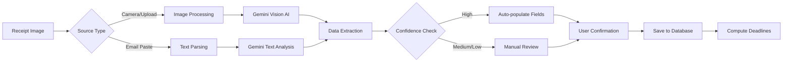
```mermaid
flowchart LR
    A[Receipt Image] --> B{Source Type}
    B -->|Camera/Upload| C[Image Processing]
    B -->|Email Paste| D[Text Parsing]
    
    C --> E[Gemini Vision AI]
    D --> F[Gemini Text Analysis]
    
    E --> G[Data Extraction]
    F --> G
    
    G --> H{Confidence Check}
    H -->|High| I[Auto-populate Fields]
    H -->|Medium/Low| J[Manual Review]
    
    I --> K[User Confirmation]
    J --> K
    
    K --> L[Save to Database]
    L --> M[Compute Deadlines]
```

### OCR Data Extraction

The Gemini Vision AI extracts:

| Field | Detection Method |
|-------|-----------------|
| Merchant | Text analysis, company suffixes (PTY, LTD, CC) |
| Date | Multiple format patterns (DD/MM/YYYY, YYYY-MM-DD, etc.) |
| Total | Currency patterns (R, ZAR), "Total" keywords |
| VAT | Explicit extraction, subtotal calculation, 15% estimation |
| Invoice | Patterns: INV-, Invoice #, Receipt No., TX- |
| Policies | Keywords: "return", "refund", "exchange", "warranty" |

### VAT Extraction Logic

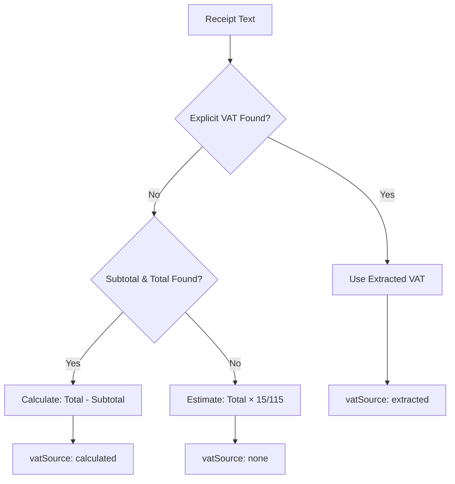
```mermaid
flowchart TD
    A[Receipt Text] --> B{Explicit VAT Found?}
    B -->|Yes| C[Use Extracted VAT]
    B -->|No| D{Subtotal & Total Found?}
    D -->|Yes| E[Calculate: Total - Subtotal]
    D -->|No| F[Estimate: Total × 15/115]
    
    C --> G[vatSource: extracted]
    E --> H[vatSource: calculated]
    F --> I[vatSource: none]
```

### Policy Detection

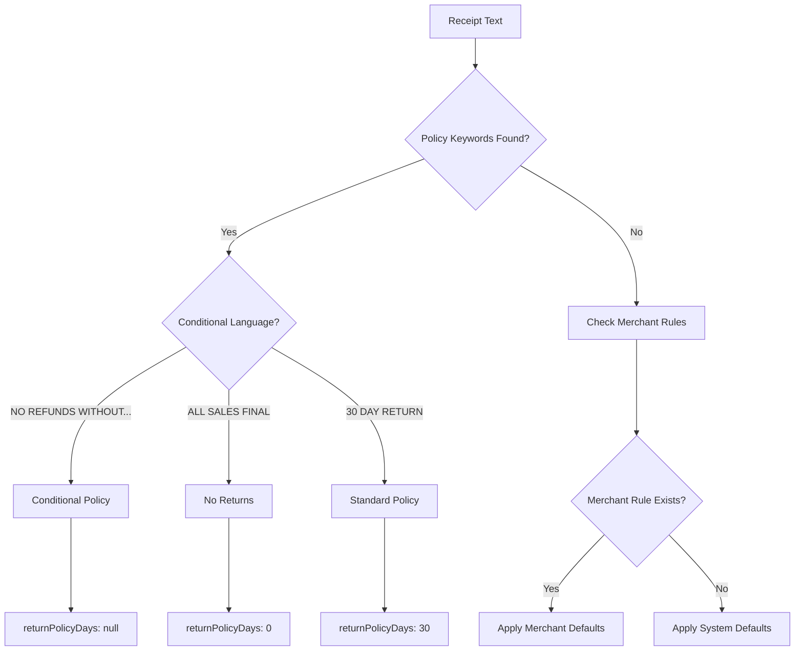
```mermaid
flowchart TD
    A[Receipt Text] --> B{Policy Keywords Found?}
    B -->|Yes| C{Conditional Language?}
    B -->|No| D[Check Merchant Rules]
    
    C -->|"NO REFUNDS WITHOUT..."| E[Conditional Policy]
    C -->|"ALL SALES FINAL"| F[No Returns]
    C -->|"30 DAY RETURN"| G[Standard Policy]
    
    E --> H[returnPolicyDays: null]
    F --> I[returnPolicyDays: 0]
    G --> J[returnPolicyDays: 30]
    
    D --> K{Merchant Rule Exists?}
    K -->|Yes| L[Apply Merchant Defaults]
    K -->|No| M[Apply System Defaults]
```

---

## Authentication Flow

### Registration & Verification

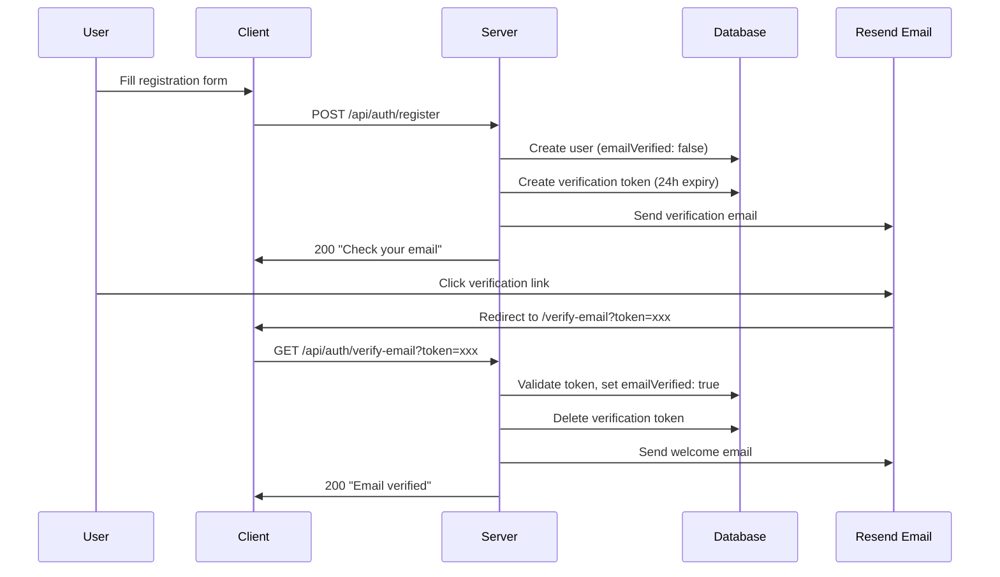
```mermaid
sequenceDiagram
    participant U as User
    participant C as Client
    participant S as Server
    participant DB as Database
    participant E as Resend Email

    U->>C: Fill registration form
    C->>S: POST /api/auth/register
    S->>DB: Create user (emailVerified: false)
    S->>DB: Create verification token (24h expiry)
    S->>E: Send verification email
    S->>C: 200 "Check your email"
    
    U->>E: Click verification link
    E->>C: Redirect to /verify-email?token=xxx
    C->>S: GET /api/auth/verify-email?token=xxx
    S->>DB: Validate token, set emailVerified: true
    S->>DB: Delete verification token
    S->>E: Send welcome email
    S->>C: 200 "Email verified"
```

### Login Flow

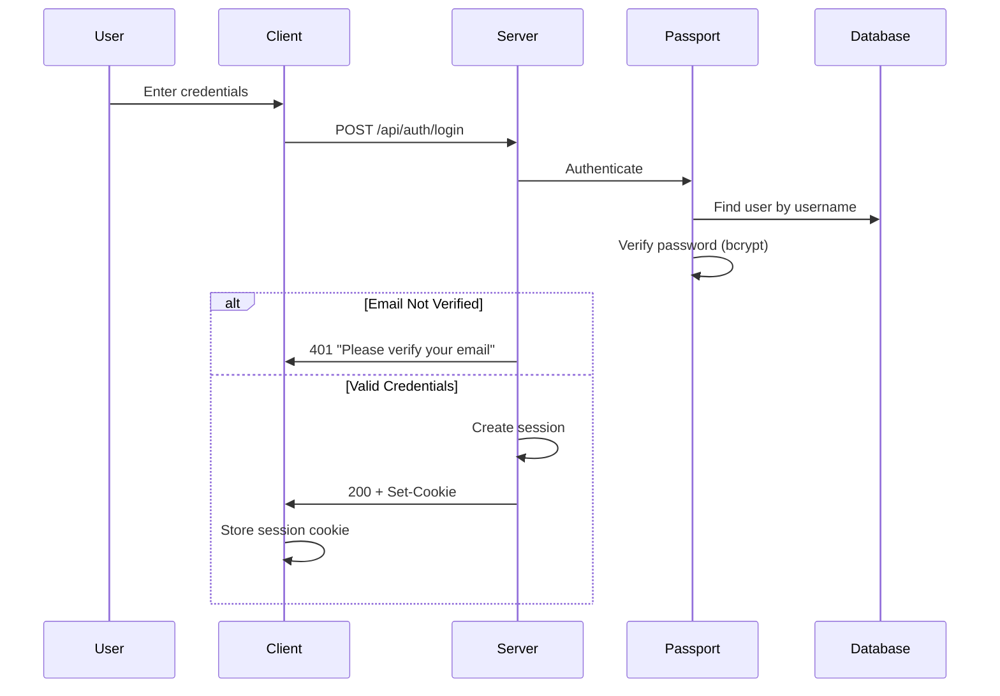
```mermaid
sequenceDiagram
    participant U as User
    participant C as Client
    participant S as Server
    participant P as Passport
    participant DB as Database

    U->>C: Enter credentials
    C->>S: POST /api/auth/login
    S->>P: Authenticate
    P->>DB: Find user by username
    P->>P: Verify password (bcrypt)
    
    alt Email Not Verified
        S->>C: 401 "Please verify your email"
    else Valid Credentials
        S->>S: Create session
        S->>C: 200 + Set-Cookie
        C->>C: Store session cookie
    end
```

### Password Reset

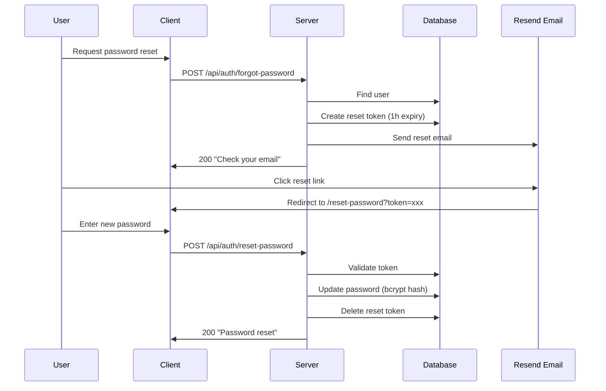
```mermaid
sequenceDiagram
    participant U as User
    participant C as Client
    participant S as Server
    participant DB as Database
    participant E as Resend Email

    U->>C: Request password reset
    C->>S: POST /api/auth/forgot-password
    S->>DB: Find user
    S->>DB: Create reset token (1h expiry)
    S->>E: Send reset email
    S->>C: 200 "Check your email"
    
    U->>E: Click reset link
    E->>C: Redirect to /reset-password?token=xxx
    U->>C: Enter new password
    C->>S: POST /api/auth/reset-password
    S->>DB: Validate token
    S->>DB: Update password (bcrypt hash)
    S->>DB: Delete reset token
    S->>C: 200 "Password reset"
```

---

## Data Model

### Entity Relationship Diagram

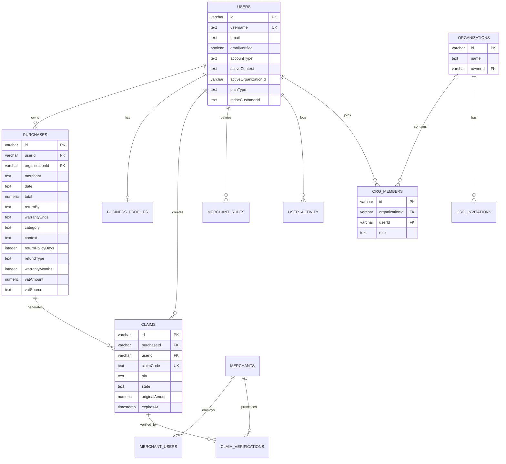
```mermaid
erDiagram
    USERS ||--o{ PURCHASES : owns
    USERS ||--o| BUSINESS_PROFILES : has
    USERS ||--o{ CLAIMS : creates
    USERS ||--o{ MERCHANT_RULES : defines
    USERS ||--o{ USER_ACTIVITY : logs
    
    ORGANIZATIONS ||--o{ ORG_MEMBERS : contains
    ORGANIZATIONS ||--o{ ORG_INVITATIONS : has
    USERS ||--o{ ORG_MEMBERS : joins
    
    PURCHASES ||--o{ CLAIMS : generates
    
    MERCHANTS ||--o{ MERCHANT_USERS : employs
    MERCHANTS ||--o{ CLAIM_VERIFICATIONS : processes
    
    CLAIMS ||--o{ CLAIM_VERIFICATIONS : verified_by

    USERS {
        varchar id PK
        text username UK
        text email
        boolean emailVerified
        text accountType
        text activeContext
        varchar activeOrganizationId
        text planType
        text stripeCustomerId
    }

    PURCHASES {
        varchar id PK
        varchar userId FK
        varchar organizationId FK
        text merchant
        text date
        numeric total
        text returnBy
        text warrantyEnds
        text category
        text context
        integer returnPolicyDays
        text refundType
        integer warrantyMonths
        numeric vatAmount
        text vatSource
    }

    CLAIMS {
        varchar id PK
        varchar purchaseId FK
        varchar userId FK
        text claimCode UK
        text pin
        text state
        numeric originalAmount
        timestamp expiresAt
    }

    ORGANIZATIONS {
        varchar id PK
        text name
        varchar ownerId FK
    }

    ORG_MEMBERS {
        varchar id PK
        varchar organizationId FK
        varchar userId FK
        text role
    }
```

### Key Tables

| Table | Purpose |
|-------|---------|
| users | User accounts with auth, subscription, context |
| purchases | Receipt records with policies and deadlines |
| claims | Verifiable claims with QR codes and PINs |
| organizations | Team workspaces |
| organization_members | Team membership with roles |
| organization_invitations | Pending team invitations |
| business_profiles | Extended business information |
| merchant_rules | Custom merchant policy defaults |
| merchants | Registered merchant businesses |
| merchant_users | Merchant staff accounts |
| claim_verifications | Audit log of claim verifications |
| user_activity | User action logging |
| password_reset_tokens | Password recovery tokens |
| email_verification_tokens | Email verification tokens |
| settings | User preferences |

---

## Context Switching

### Context Flow

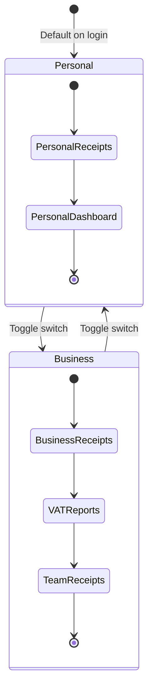
```mermaid
stateDiagram-v2
    [*] --> Personal: Default on login
    
    Personal --> Business: Toggle switch
    Business --> Personal: Toggle switch
    
    state Personal {
        [*] --> PersonalReceipts
        PersonalReceipts --> PersonalDashboard
        PersonalDashboard --> [*]
    }
    
    state Business {
        [*] --> BusinessReceipts
        BusinessReceipts --> VATReports
        VATReports --> TeamReceipts
        TeamReceipts --> [*]
    }
```

### Context Rules

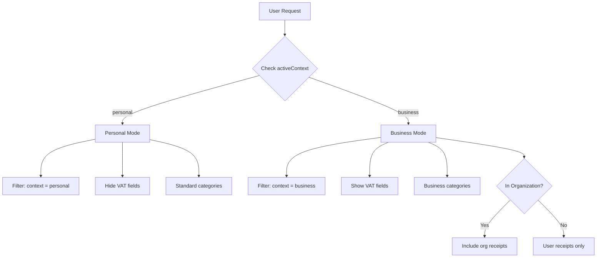
```mermaid
flowchart TD
    A[User Request] --> B{Check activeContext}
    
    B -->|personal| C[Personal Mode]
    B -->|business| D[Business Mode]
    
    C --> E[Filter: context = personal]
    C --> F[Hide VAT fields]
    C --> G[Standard categories]
    
    D --> H[Filter: context = business]
    D --> I[Show VAT fields]
    D --> J[Business categories]
    D --> K{In Organization?}
    
    K -->|Yes| L[Include org receipts]
    K -->|No| M[User receipts only]
```

---

## Claims Lifecycle

### State Machine

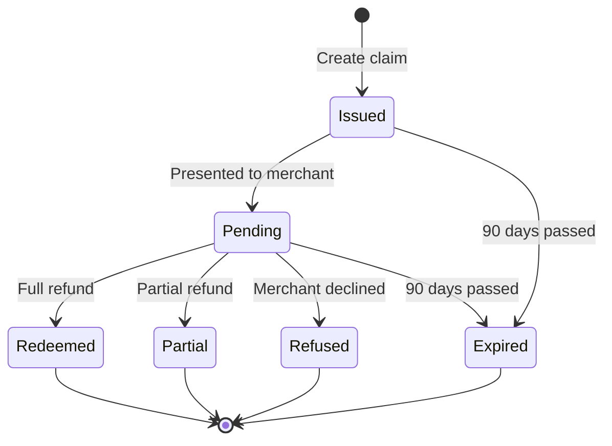
```mermaid
stateDiagram-v2
    [*] --> Issued: Create claim
    
    Issued --> Pending: Presented to merchant
    Issued --> Expired: 90 days passed
    
    Pending --> Redeemed: Full refund
    Pending --> Partial: Partial refund
    Pending --> Refused: Merchant declined
    Pending --> Expired: 90 days passed
    
    Redeemed --> [*]
    Partial --> [*]
    Refused --> [*]
    Expired --> [*]
```

### Claim Verification Flow

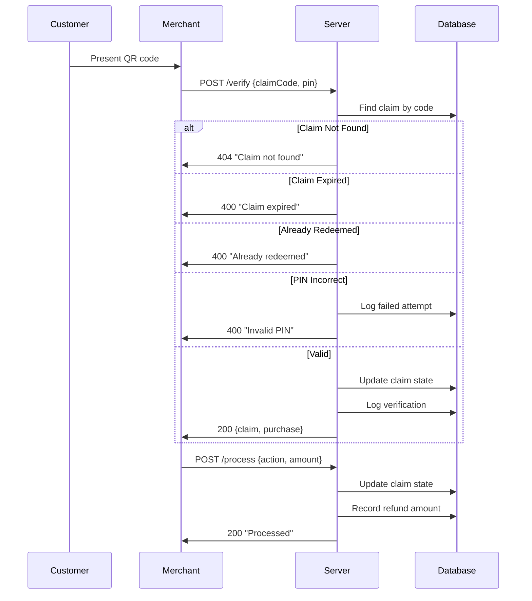
```mermaid
sequenceDiagram
    participant Customer
    participant Merchant
    participant Server
    participant Database

    Customer->>Merchant: Present QR code
    Merchant->>Server: POST /verify {claimCode, pin}
    Server->>Database: Find claim by code
    
    alt Claim Not Found
        Server->>Merchant: 404 "Claim not found"
    else Claim Expired
        Server->>Merchant: 400 "Claim expired"
    else Already Redeemed
        Server->>Merchant: 400 "Already redeemed"
    else PIN Incorrect
        Server->>Database: Log failed attempt
        Server->>Merchant: 400 "Invalid PIN"
    else Valid
        Server->>Database: Update claim state
        Server->>Database: Log verification
        Server->>Merchant: 200 {claim, purchase}
    end
    
    Merchant->>Server: POST /process {action, amount}
    Server->>Database: Update claim state
    Server->>Database: Record refund amount
    Server->>Merchant: 200 "Processed"
```

---

## Billing Integration

### Stripe Flow

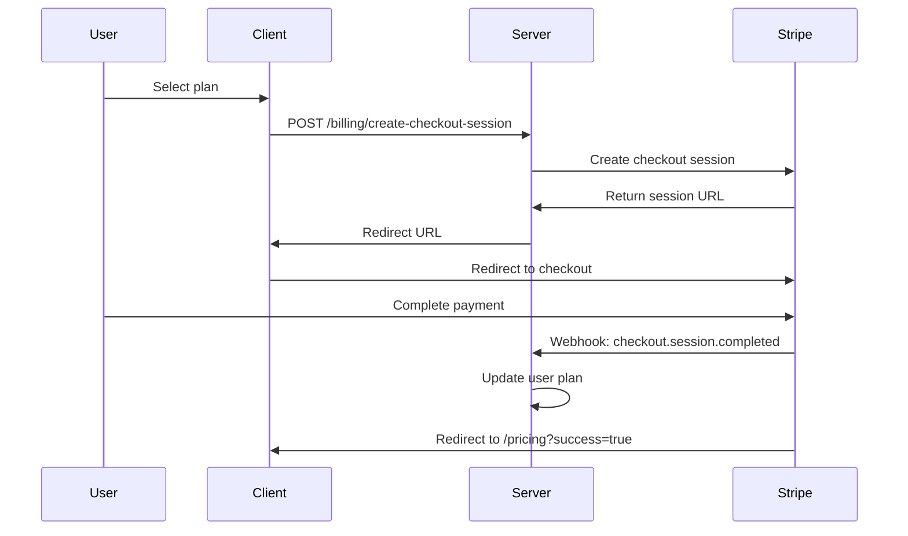
```mermaid
sequenceDiagram
    participant User
    participant Client
    participant Server
    participant Stripe

    User->>Client: Select plan
    Client->>Server: POST /billing/create-checkout-session
    Server->>Stripe: Create checkout session
    Stripe->>Server: Return session URL
    Server->>Client: Redirect URL
    Client->>Stripe: Redirect to checkout
    
    User->>Stripe: Complete payment
    Stripe->>Server: Webhook: checkout.session.completed
    Server->>Server: Update user plan
    Stripe->>Client: Redirect to /pricing?success=true
```

### Subscription Plans

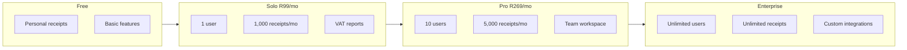
```mermaid
flowchart LR
    subgraph Free
        F1[Personal receipts]
        F2[Basic features]
    end
    
    subgraph Solo["Solo R99/mo"]
        S1[1 user]
        S2[1,000 receipts/mo]
        S3[VAT reports]
    end
    
    subgraph Pro["Pro R269/mo"]
        P1[10 users]
        P2[5,000 receipts/mo]
        P3[Team workspace]
    end
    
    subgraph Enterprise
        E1[Unlimited users]
        E2[Unlimited receipts]
        E3[Custom integrations]
    end
    
    Free --> Solo
    Solo --> Pro
    Pro --> Enterprise
```

### Plan Limits Enforcement

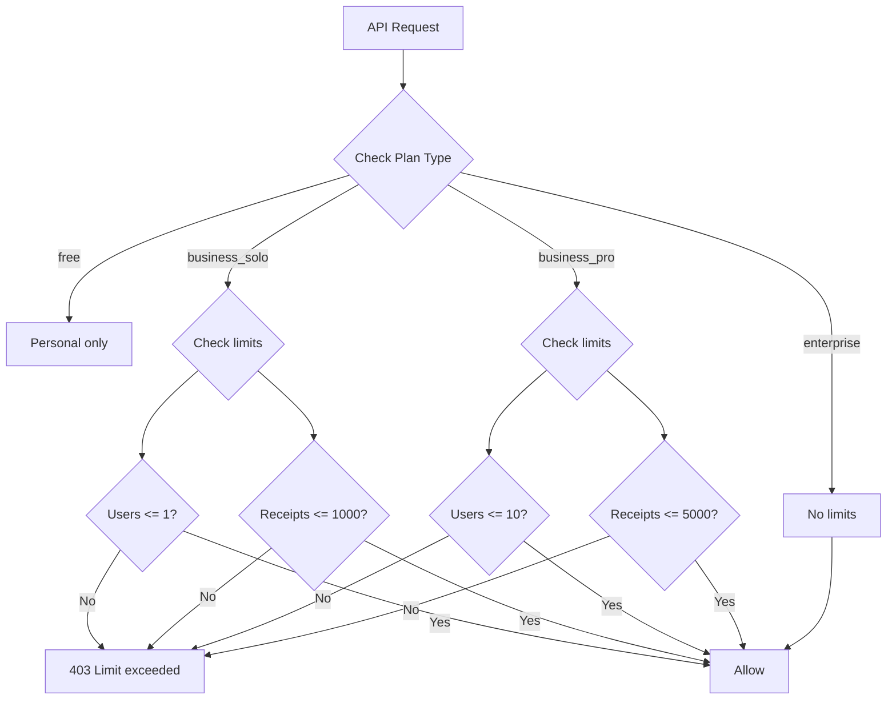
```mermaid
flowchart TD
    A[API Request] --> B{Check Plan Type}
    
    B -->|free| C[Personal only]
    B -->|business_solo| D{Check limits}
    B -->|business_pro| E{Check limits}
    B -->|enterprise| F[No limits]
    
    D --> G{Users <= 1?}
    D --> H{Receipts <= 1000?}
    
    E --> I{Users <= 10?}
    E --> J{Receipts <= 5000?}
    
    G -->|No| K[403 Limit exceeded]
    H -->|No| K
    I -->|No| K
    J -->|No| K
    
    G -->|Yes| L[Allow]
    H -->|Yes| L
    I -->|Yes| L
    J -->|Yes| L
    F --> L
```

---

## Organization Hierarchy

### Role Permissions

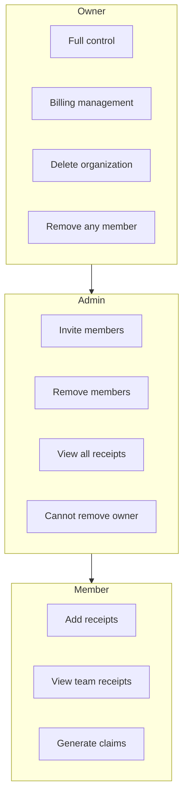
```mermaid
flowchart TB
    subgraph Owner
        O1[Full control]
        O2[Billing management]
        O3[Delete organization]
        O4[Remove any member]
    end
    
    subgraph Admin
        A1[Invite members]
        A2[Remove members]
        A3[View all receipts]
        A4[Cannot remove owner]
    end
    
    subgraph Member
        M1[Add receipts]
        M2[View team receipts]
        M3[Generate claims]
    end
    
    Owner --> Admin
    Admin --> Member
```

### Invitation Flow

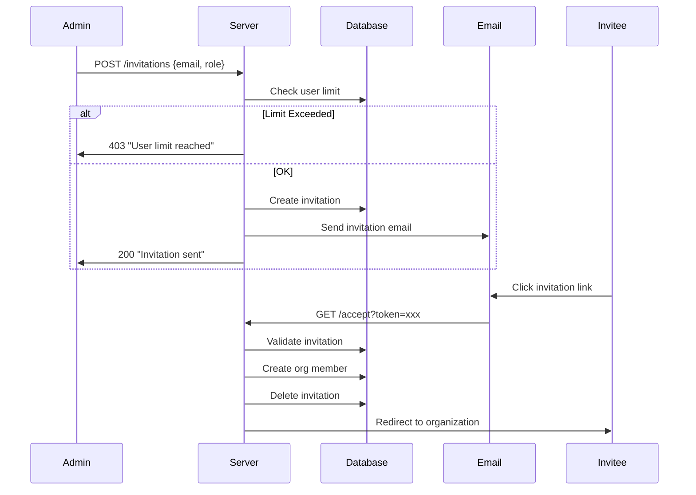
```mermaid
sequenceDiagram
    participant Admin
    participant Server
    participant Database
    participant Email
    participant Invitee

    Admin->>Server: POST /invitations {email, role}
    Server->>Database: Check user limit
    
    alt Limit Exceeded
        Server->>Admin: 403 "User limit reached"
    else OK
        Server->>Database: Create invitation
        Server->>Email: Send invitation email
        Server->>Admin: 200 "Invitation sent"
    end
    
    Invitee->>Email: Click invitation link
    Email->>Server: GET /accept?token=xxx
    Server->>Database: Validate invitation
    Server->>Database: Create org member
    Server->>Database: Delete invitation
    Server->>Invitee: Redirect to organization
```

---

## PWA Architecture

### Caching Strategy

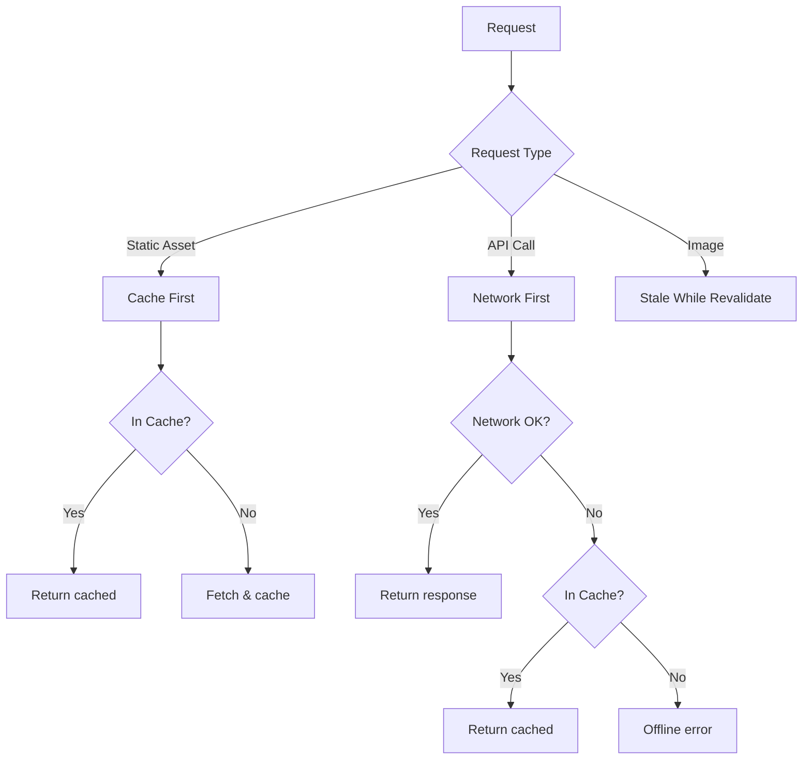
```mermaid
flowchart TD
    A[Request] --> B{Request Type}
    
    B -->|Static Asset| C[Cache First]
    B -->|API Call| D[Network First]
    B -->|Image| E[Stale While Revalidate]
    
    C --> F{In Cache?}
    F -->|Yes| G[Return cached]
    F -->|No| H[Fetch & cache]
    
    D --> I{Network OK?}
    I -->|Yes| J[Return response]
    I -->|No| K{In Cache?}
    K -->|Yes| L[Return cached]
    K -->|No| M[Offline error]
```

### Offline Sync

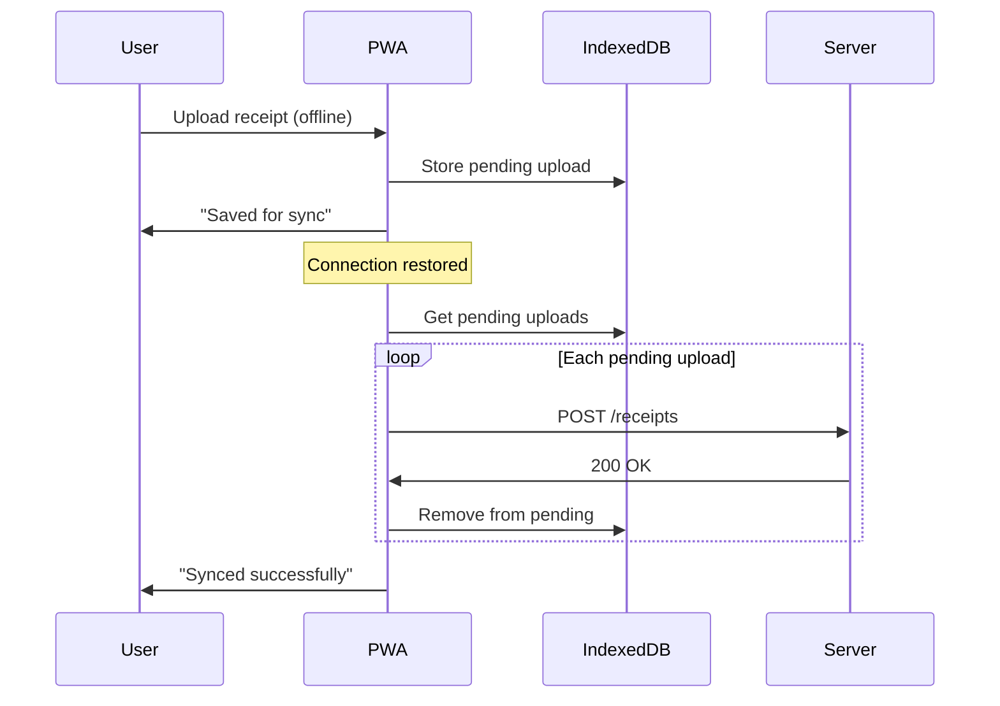
```mermaid
sequenceDiagram
    participant User
    participant PWA
    participant IndexedDB
    participant Server

    User->>PWA: Upload receipt (offline)
    PWA->>IndexedDB: Store pending upload
    PWA->>User: "Saved for sync"
    
    Note over PWA: Connection restored
    
    PWA->>IndexedDB: Get pending uploads
    loop Each pending upload
        PWA->>Server: POST /receipts
        Server->>PWA: 200 OK
        PWA->>IndexedDB: Remove from pending
    end
    PWA->>User: "Synced successfully"
```

### Service Worker Lifecycle

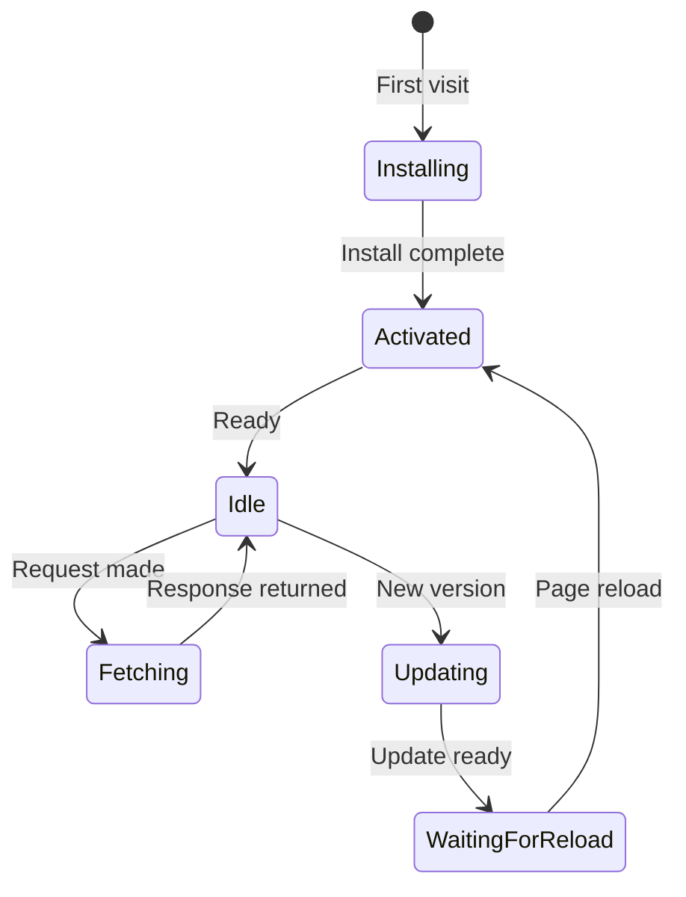
```mermaid
stateDiagram-v2
    [*] --> Installing: First visit
    Installing --> Activated: Install complete
    Activated --> Idle: Ready
    
    Idle --> Fetching: Request made
    Fetching --> Idle: Response returned
    
    Idle --> Updating: New version
    Updating --> WaitingForReload: Update ready
    WaitingForReload --> Activated: Page reload
```

---

## Security Architecture

### Authentication Layers

```mermaid
flowchart TD
    A[Request] --> B[Rate Limiter]
    B --> C{Authenticated?}
    
    C -->|No| D[Public routes only]
    C -->|Yes| E[Session validation]
    
    E --> F{Valid session?}
    F -->|No| G[401 Unauthorized]
    F -->|Yes| H{Check permissions}
    
    H --> I{Admin route?}
    I -->|Yes| J{Is admin?}
    J -->|No| K[403 Forbidden]
    J -->|Yes| L[Allow]
    
    I -->|No| M{Org route?}
    M -->|Yes| N{Member of org?}
    N -->|No| K
    N -->|Yes| L
    
    M -->|No| L
```

### Data Protection

| Layer | Protection |
|-------|-----------|
| Transport | HTTPS/TLS |
| Passwords | bcrypt hashing (10 rounds) |
| Sessions | HttpOnly, Secure cookies |
| Claims | JWT signing, PIN hashing |
| API Keys | SHA-256 hashing |
| Tokens | Cryptographic random, expiry |

---

## Performance Considerations

### Database Optimization

- Indexed columns: userId, merchantName, hash, claimCode
- Unique constraints: user+hash (deduplication)
- Pagination for list queries
- Connection pooling via Neon

### Caching

- OCR results cached for retry operations
- Static assets cached by service worker
- React Query caching for API responses

### Image Processing

- Client-side resize before upload
- Maximum 10MB file size
- WebP conversion where supported

---

*SlipSafe Technical Architecture v1.0*
